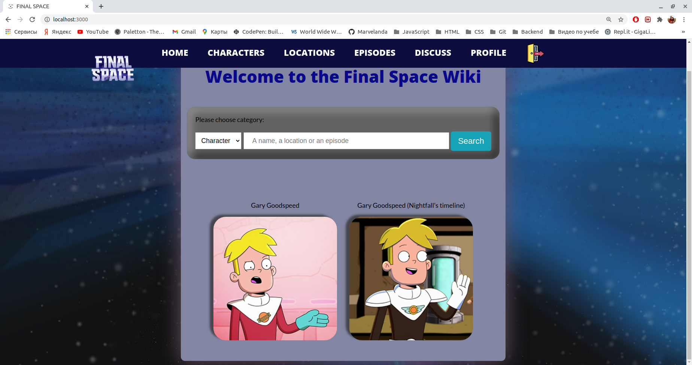
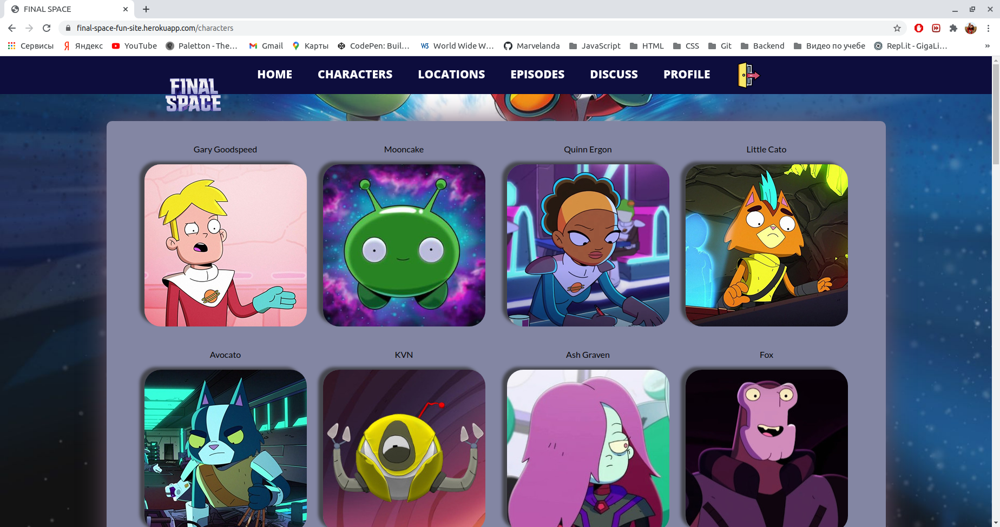

# Final_space_fan_site

Final Space fan site with a small discussion forum.

Deployed on Heroku - https://final-space-fun-site.herokuapp.com/.
Stack - html, css, javascript, nodejs, express, mongodb, handlebars.
Used the following API - https://finalspaceapi.com/docs/.

In order to check the site you can log in as mike@gmail.com with a password 123456789.
Sign up also works.

After signin you will come to the main page where it is possible to search characters, episodes or locations:

You can also get all characters, locations or episodes:

In order to dicuss TV show it is possible to go to a small discussion forum:

Adding files or emojies is available. Posts are added via AJAX. 

